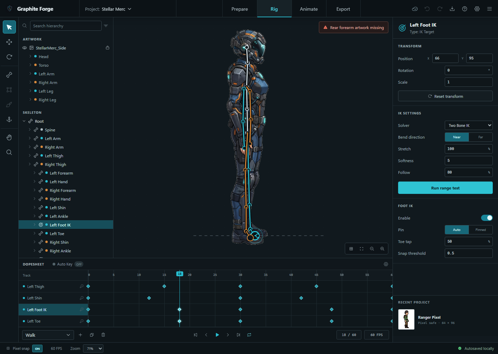

# Graphite Forge

[](https://github.com/soundtrackgeek/animation_studio/actions/workflows/windows-installer.yml)

Graphite Forge is a focused desktop studio for fitting a side-view 2D sprite to a small humanoid rig, posing it, and authoring a first animation clip. The v0.x series is deliberately narrow so the workflow can be shaped in stages.



## Current v0.x scope

- One side-view humanoid project using the supplied Stellar Merc artwork
- Hierarchy selection and direct joint dragging on the canvas
- Near- and far-side bones plus hand and foot IK targets
- Prepare, Rig, Animate, and Export workspaces
- One Walk clip with key markers, frame stepping, playback, Auto Key, and a range test
- Native `.gforge` project open/save and JSON metadata export through Tauri
- Automatic signed update checks with an in-app download, install, and restart flow
- Browser fallbacks for previewing the interface without the desktop shell

Mesh generation, weight painting, AI auto-rigging, curve editing, physics, multiple characters, skins, and rendered sprite-sheet export are intentionally outside this release.

## Run it

Requirements:

- Node.js 22 LTS or newer
- Current stable Rust toolchain
- Tauri 2 system prerequisites; on Windows this includes Microsoft Edge WebView2 and the Microsoft C++ build tools

Install dependencies:

```powershell
npm ci
```

Run the desktop application:

```powershell
npm run tauri:dev
```

For a fast browser preview:

```powershell
npm run dev
```

Then open `http://127.0.0.1:1420`.

## Install the Windows app

Download the latest version from [GitHub Releases](https://github.com/soundtrackgeek/animation_studio/releases/latest), then run the attached `Graphite Forge_..._x64-setup.exe`. The adjacent `.sha256` file can be used to verify the download.

Every branch push is also verified and packaged by the **Windows Installer** workflow in GitHub Actions. Those temporary workflow artifacts are useful for development builds; pushing a matching `vMAJOR.MINOR.PATCH` tag publishes the verified installer and checksum as a durable GitHub Release.

The installer:

- Installs for the current Windows user without requiring administrator access
- Adds a Start menu shortcut and a standard Windows uninstaller
- Includes the Microsoft WebView2 bootstrapper for dependable first-time setup
- Prevents an older Graphite Forge build from replacing a newer installed version

Development builds are not code-signed yet, so Windows may show a SmartScreen warning. Code signing will be added separately when a signing certificate is available.

### In-app updates

The installed app checks GitHub Releases when it opens and every five minutes by default. If a newer signed version is available, a notification appears in the lower-right corner. Choose **Update & restart** to download and install it without leaving Graphite Forge.

Open the gear menu in the top bar to:

- Check for an update manually
- Turn automatic checks on or off
- Change the interval to 5, 15, 30, or 60 minutes

Choosing **Later** hides that version for the rest of the current session. Update packages are verified with the updater signing key before installation.

To create the installer locally:

```powershell
npm ci
npm run tauri:build
```

The setup executable and its bundled files are written to `src-tauri/target/release/bundle/nsis`. To build only the unpackaged executable, use `npm run tauri:build:binary`.

The ordinary local build does not require updater signing. A release build needs the private updater key and its password:

```powershell
$env:TAURI_SIGNING_PRIVATE_KEY = "C:\path\to\graphite-forge-updater.key"
$env:TAURI_SIGNING_PRIVATE_KEY_PASSWORD = Get-Content "C:\path\to\graphite-forge-updater.password" -Raw
npm run tauri:build:release
node scripts/prepare-updater-release.mjs
```

Keep the private key and password outside the repository and back them up securely. GitHub Actions reads them from the `TAURI_SIGNING_PRIVATE_KEY` and `TAURI_SIGNING_PRIVATE_KEY_PASSWORD` repository secrets. The release build produces the installer signature and `latest.json` metadata required by the in-app updater.

To publish a version after its version files and changelog are updated and committed:

```powershell
$version = (Get-Content package.json | ConvertFrom-Json).version
git tag -a "v$version" -m "Graphite Forge v$version"
git push origin "v$version"
```

The workflow rejects a release tag that does not match the application version.

## Controls

| Input | Action |
| --- | --- |
| `Q` | Select tool |
| `W` | Move tool |
| `E` | Rotate tool |
| `B` | Bone tool |
| `K` | Keyframe tool |
| Drag a joint | Reposition the selected rig joint; Auto Key records the active animation frame |
| `Space` | Play or pause the active clip |
| Left / Right arrow | Step one frame |
| `Ctrl+S` | Save the project |

### Add an animation key

1. Open **Animate** and select a timeline track.
2. Click the track lane at the frame you want to edit.
3. Turn **Auto Key** on.
4. Drag the selected joint or IK target in the viewport.
5. Confirm the green **Key saved** state in the inspector and the enlarged amber key marker on the active frame. A short Auto Key confirmation also appears after the edit.

Auto Key is available only in **Animate**. Moving joints in **Rig** edits the rest pose and does not create animation keys; leaving Animate automatically turns Auto Key off.

## Project data

- `.gforge` stores the editable Graphite Forge project as versioned JSON.
- JSON export writes engine-friendly rig, pose, and clip metadata.
- Rendered sprite-sheet export is visible as a future option but disabled in v0.1.0.

## Verify and build

```powershell
npm run check
npm run test:sites
npm run test:updater-release
cargo test --manifest-path src-tauri/Cargo.toml
npm run build
npm run tauri:build
```

`npm run tauri:build` creates the Windows NSIS setup executable. On every push, GitHub Actions runs the frontend and Rust checks, builds the signed updater installer, generates its signature, update manifest, and SHA-256 checksum, and keeps them as a downloadable artifact for 14 days. Version tags additionally publish those verified files under GitHub Releases. The selected design, implementation evidence, and QA report live under [`docs/design`](docs/design) and [`design-qa.md`](design-qa.md).

## Next stage

The next feature release is intentionally undecided. Candidate workflows include richer rig setup, real mesh/weight editing, or rendered sprite-sheet export; the choice should follow hands-on feedback from the current v0.x build.
